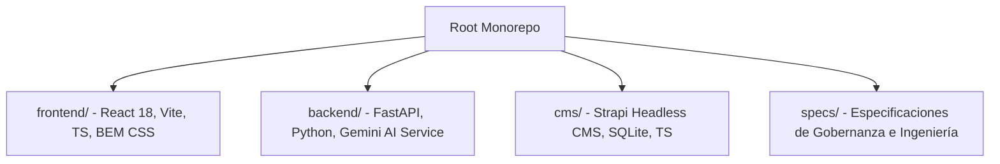

# jhon-delgado.dev — Monorepo Personal Portfolio

Este repositorio contiene la arquitectura de monorepo desacoplada en tres capas para el portafolio personal e AI Twin de **Jhon Delgado**.

---

## 🏗️ Arquitectura del Monorepo

El proyecto está dividido en tres capas principales con responsabilidades totalmente separadas:



### 1. 🖥️ Frontend (`frontend/`)
* **Tecnologías:** React 18, TypeScript, Vite, CSS Modules (con metodología BEM estricta) y Framer Motion para micro-interacciones.
* **Propósito:** Capa visual de presentación rápida que renderiza los proyectos destacados, la trayectoria profesional, el stack técnico y ofrece una interfaz interactiva de chat por medio de un widget flotante.

### 2. ⚙️ Backend (`backend/`)
* **Tecnologías:** FastAPI, Python 3, Pydantic y el SDK oficial de Google Generative AI (`gemini-2.5-flash`).
* **Propósito:** Endpoint seguro (`/api/chat`) que procesa los mensajes del usuario, administra el historial de chat de forma segura y expone el **AI Twin (Gemelo Digital)** instruido con el perfil y experiencia de Jhon.

### 3. 📦 CMS (`cms/`)
* **Tecnologías:** Strapi Headless CMS, TypeScript y base de datos SQLite.
* **Propósito:** Panel administrativo autohospedado para gestionar dinámicamente la información de proyectos, trayectoria profesional, habilidades y biografía del portafolio.

---

## 🚀 Instrucciones de Inicio Rápido

### Requisitos Previos
* Node.js v18+ y npm
* Python 3.10+

### Ejecución de Módulos

#### Frontend
```bash
cd frontend
npm install
npm run dev
```
*Corre localmente en:* [http://localhost:5173](http://localhost:5173)

#### Backend
1. Crea un archivo `.env` dentro de `backend/` basado en `.env.example` y define tu `GEMINI_API_KEY`.
2. Ejecuta el servidor:
```bash
cd backend
python -m venv .venv
# En Windows:
.venv\Scripts\activate
# Instalar dependencias:
pip install -r requirements.txt
# Iniciar servidor:
uvicorn app.main:app --reload
```
*Corre localmente en:* [http://localhost:8000](http://localhost:8000)

#### CMS (Strapi)
```bash
cd cms
npm install
npm run develop
```
*Corre localmente en:* [http://localhost:1337/admin](http://localhost:1337/admin)

---

## 📝 Documentación técnica y especificaciones
Las guías de diseño, gobernanza de IA y esquemas de Strapi están ubicadas en la carpeta de la raíz:
* [01-code-standards.md](file:///specs/01-code-standards.md): Estándares de calidad y tipado estricto.
* [02-architecture-design.md](file:///specs/02-architecture-design.md): Arquitectura de software y flujo de datos.
* [03-style-guide.md](file:///specs/03-style-guide.md): Guía de diseño responsivo mobile-first sin Tailwind.
* [04-agent-workflow.md](file:///specs/04-agent-workflow.md): Reglas del flujo de trabajo de IA.
* [05-cms-schemas.md](file:///specs/05-cms-schemas.md): Especificación técnica de tipos en Strapi.
