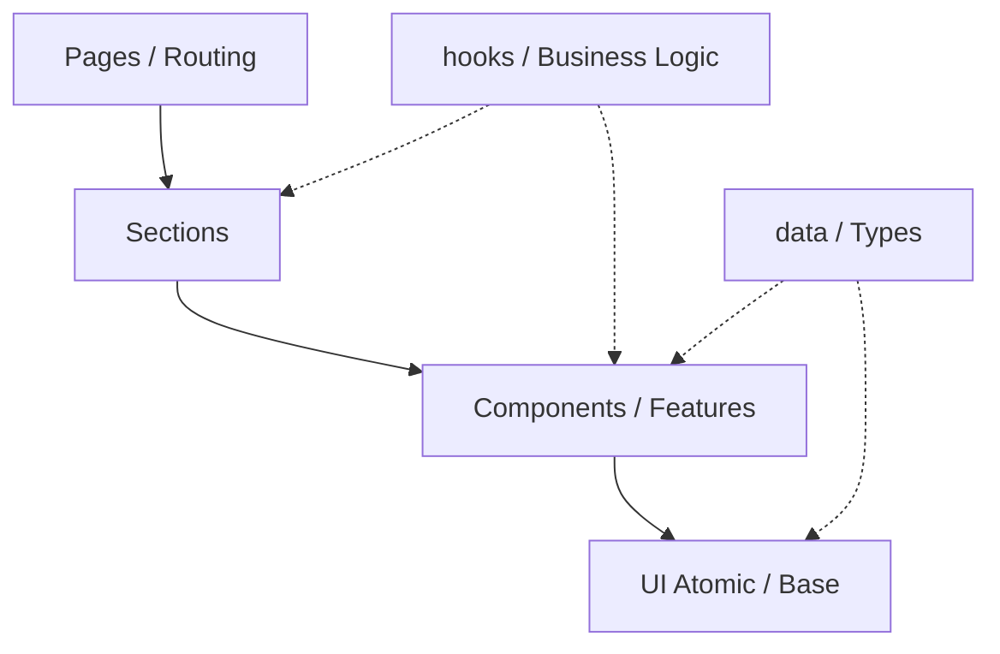

# Diseño Arquitectónico y Estructura del Proyecto

Este documento establece las reglas de diseño arquitectónico y de organización de archivos del portafolio. Nuestro objetivo es lograr una arquitectura altamente modular, desacoplada y escalable.

---

## 1. Estructura de Capas Modulares

La interfaz de usuario y sus piezas de soporte se organizan bajo una jerarquía modular estricta de capas. Cada archivo debe pertenecer exclusivamente a una capa según su nivel de granularidad y responsabilidad.



### 1.1 Capas del Frontend
* **`@/components/ui/` (Atomic / Base):**
  * Componentes elementales que carecen de dependencia con la lógica del negocio.
  * *Ejemplos:* `Button`, `Input`, `Badge`, `Card`, `Tooltip`.
  * Diseñados para ser reutilizables en cualquier otro proyecto. Dependen únicamente de clases Tailwind, `clsx`, `tailwind-merge` y props de UI.
* **`@/components/` (Components / Features):**
  * Componentes compuestos que agrupan componentes atómicos e implementan un comportamiento interactivo genérico o lógica de UI directa.
  * *Ejemplos:* `ProjectCard`, `TechIconList`, `SkillProgressBar`.
* **`@/components/sections/` (Sections):**
  * Bloques principales de una página web que representan secciones semánticas completas (ej. contenedores `<section>`).
  * *Ejemplos:* `HeroSection`, `PortfolioSection`, `ContactSection`, `ExperienceTimeline`.
  * Conectan la lógica de negocio global o local y orquestan los componentes internos.
* **`@/pages/` (o `@/app/` si es Next.js App Router):**
  * Contenedores de ruta de primer nivel. Se encargan del Layout principal de la página, inyección de metadatos SEO y enrutamiento del lado del cliente.

---

## 2. Regla de Aislamiento de Datos e Interfaces

Para evitar que los datos estáticos o mockeados contaminen el marcado visual y dificulten futuras migraciones a CMS o APIs, los datos y definiciones deben aislarse estrictamente.

### 2.1 Datos e Información (`@/data/`)
* **Regla:** Ningún componente UI debe declarar arrays de proyectos, experiencias o tecnologías de forma local.
* Todos los datos planos deben residir en la carpeta `@/data/` en archivos con nombres descriptivos (ej. `projects.ts`, `experience.ts`, `skills.ts`).
* Estos archivos deben exportar constantes tipadas con las interfaces correspondientes.

```typescript
// @/data/projects.ts
import { Project } from '@/types/project';

export const projects: Project[] = [
  {
    id: '1',
    title: 'Portafolio Profesional',
    description: 'Mi portafolio personal construido con React 18, Tailwind y Framer Motion.',
    tags: ['React', 'TypeScript', 'Tailwind CSS'],
    liveUrl: 'https://jhon-delgado.dev',
    githubUrl: 'https://github.com/jsda14/jhon-delgado.dev',
    featured: true
  }
];
```

### 2.2 Modelado de Datos y Contratos (`@/types/`)
* Todas las definiciones de interfaces, tipos de unión o enums compartidos deben colocarse dentro de `@/types/` (ej. `@/types/project.ts`, `@/types/common.ts`).
* Evita exportar tipos directamente de los componentes de React, a menos que sean tipos sumamente específicos de props que solo consume dicho componente de forma local.

---

## 3. Patrón de Componentes: Lógica (Hooks) vs. Presentación (UI)

Separar el estado complejo del marcado es clave para la mantenibilidad.

* **Componentes de Presentación (Dumb Components):**
  * Reciben datos mediante props y emiten interacciones mediante callbacks (`onClick`, `onChange`).
  * No manejan efectos asíncronos (`fetch`, bases de datos, etc.).
  * *Ejemplo:* Un componente `ContactForm` que recibe `onSubmit` y un estado de `isSubmitting` como props.
* **Hooks y Controladores de Lógica (Smart Logic):**
  * El estado interactivo complejo, el envío de formularios a APIs o el almacenamiento local debe residir en hooks dedicados (ej. `useContactForm.ts`).
  * Esto permite que el componente de presentación sea limpio y fácil de refactorizar visualmente.

---

## 4. Uso Estricto de Alias de Importación

Para evitar rutas de importación relativas confusas como `../../../components/ui/Button`, se define el uso obligatorio del alias global `@/`.

### 4.1 Mapeo de Directorios en `tsconfig.json`
Las importaciones deben estar organizadas de la siguiente manera:
* `@/components/*` -> Componentes de UI, Features y Secciones.
* `@/types/*` -> Interfaces y declaraciones de TypeScript.
* `@/utils/*` -> Funciones helper utilitarias puras (formateadores de fecha, etc.).
* `@/hooks/*` -> Custom Hooks de React.
* `@/styles/*` -> Archivos CSS globales y tokens de diseño.
* `@/data/*` -> Constantes de datos estáticos y mocks.
* `@/assets/*` -> Imágenes, SVGs estáticos y tipografías.

```typescript
// ❌ INCORRECTO
import { Button } from '../../components/ui/button';
import { Project } from '../../../types';

//  CORRECTO
import { Button } from '@/components/ui/button';
import { Project } from '@/types/project';
```

---

## 5. Arquitectura de Estado Global y UI

Si la aplicación escala en complejidad interactiva (por ejemplo, filtros avanzados de portafolio, modo lectura, carrito o consola interactiva):
1. **Configuración Básica:** Utilizar React Context para estados muy acotados como el tema de colores (dark/light) o el idioma.
2. **Estado Complejo:** Si se requiere un almacén interactivo más potente sin acoplamiento, se utilizará **Zustand** o un patrón de señales ligero. Evitar Redux por sobredimensionamiento en proyectos de portafolio.
3. **Data Fetching:** Si se requiere consumo dinámico de APIs (ej. Github API para el conteo de estrellas), se utilizará `fetch` nativo encapsulado en un hook con caché o una librería ligera como SWR/React Query.
